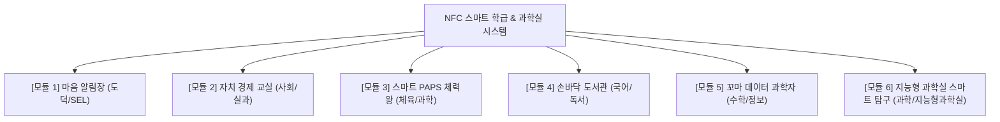

# [기획안] 2022 개정 교육과정 연계 NFC 기반 스마트 학급 프로젝트
**- "태그(Tag)로 잇는 학교생활, 데이터로 자라는 미래 역량 (지능형 과학실 융합)" -**

---

## 1. 기획 배경 및 목적

### 1.1 기획 배경
- **2022 개정 교육과정의 핵심 방향 부합**: 학생의 **자기주도성**, **디지털 소양(Digital Literacy)**, 그리고 교과 간 경계를 넘나드는 **융합 교육(STEAM)**이 강조되고 있습니다.
- **지능형 과학실(Intelligent Science Lab) 인프라와의 융합**: 교육부 첨단 미래형 과학교실 정책에 발맞추어, IoT 센서, 공공데이터(기상·대기), 과학 교구 안전 관리 등을 NFC 시스템과 결합하여 미래형 탐구 환경을 구현합니다.
- **교실 현장의 디지털 전환**: 단순한 출결 체크 기기를 넘어, 학생이 아침 등교부터 수업·자치·과학 탐구까지 직접 참여하고 데이터를 체감하는 **살아있는 에듀테크 학습 도구**로 확장합니다.
- **안전하고 윤리적인 데이터 활용**: 외부 클라우드 의존 및 개인정보 유출 우려 없이, 로컬 SQLite 기반의 안전한 환경에서 학생 스스로 자신의 생활·건강·학습 데이터를 관리하는 경험을 제공합니다.

### 1.2 프로젝트 목적
1. **생활 교육과 교과 교육의 유기적 결합**: 출석, 독서, 체육, 보상(상점), 과학 탐구를 성취기준과 직결
2. **지능형 과학실 탐구·안전 스마트화**: 과학실 기자재 대여, 실험 안전 MSDS 조회, IoT 환경 데이터 융합
3. **학생 주도형 데이터 리터러시 함양**: 매일 누적되는 학급 데이터를 수학/정보/사회/과학 교과와 연계하여 탐구
4. **따뜻한 교실 공동체 형성**: 감정 출석부 및 협력 미션을 통한 사회정서학습(SEL) 실천

---

## 2. 2022 개정 교육과정 및 지능형 과학실 연계 분석

| 연계 영역/교과 | 핵심 역량 및 성취기준 영역 | 프로젝트 내 연계 기능/요소 |
|---|---|---|
| **지능형 과학실 (Intelligent Science Lab)** | • 첨단 과학 탐구 인프라 활용<br>• 과학실 안전 및 실험기자재 관리<br>• 지능형 과학실 ON 플랫폼 데이터 연계 | • **스마트 과학 탐구 패스포트**: 실험 스테이션별 미션 이수 태그<br>• **스마트 교구·시약 관리**: MBL 센서/실험도구 NFC 대여 및 안전 수칙(MSDS) 팝업<br>• **스마트팜 생장 일지**: 식물별 관찰 데이터 태깅 |
| **과학** (3~6학년) | • 탐구 과정 (자료 변환 및 해석)<br>• 지구와 우주 (날씨와 계절의 변화)<br>• 생명 과학 (운동과 인체 구조) | • **공공데이터(기상청·에어코리아) + 센서 비교**: 지역 대기질과 과학실 환경 비교 탐구<br>• **운동 생리 탐구**: 체육 셔틀런/서킷 후 심박수·호흡 변화 연계 분석 |
| **실과 / 정보** (5~6학년) | • 디지털 기술과 생활 (IoT, 센서 원리)<br>• 데이터와 인공지능 (데이터 수집·분석)<br>• 정보보안과 개인정보 보호 | • NFC/RFID 태그의 원리와 비식별화(UID/번호) 보안 실천<br>• 센서 데이터 수집 자동화 및 데이터 시각화 |
| **도덕** (3~6학년) | • 자신과의 관계 (자기관리, 성실, 감정 인식)<br>• 타인과의 관계 (공감, 배려, 약속) | • **아침 감정 출석부**: 감정 어휘 확장 및 자기 마음 살피기<br>• **정시 등교 챌린지**: 규칙 준수와 자기관리 역량 증진 |
| **체육** (3~6학년) | • 건강 영역 (체력 관리, 체력 증진)<br>• 안전 영역 (환경 변화와 안전) | • **스마트 셔틀런 / 서킷 트레이닝**: NFC 태그로 랩타임 자동 측정<br>• **미세먼지·날씨 위젯 연계**: 야외/실내 체육 활동 안전 판단 |
| **사회** (3~6학년) | • 경제 생활과 선택 (합리적 소비, 저축)<br>• 민주주의와 자치 (학급 자치) | • **포인트 상점 / 학급 화폐 연계**: 학급 규칙 실천 및 칭찬 포인트 경제 실습 |
| **수학** (3~6학년) | • 자료와 가능성 (통계, 꺾은선그래프, 비율) | • 출석률, 체육 기록, 과학 환경 데이터의 꺾은선그래프 및 백분율 분석 |
| **국어 / 창체** (전 학년) | • 독서 활동 (한 학기 한 권 읽기)<br>• 자율·자치·동아리 활동 | • **손바닥 NFC 도서관**: 간편 대여/반납 및 다독 챌린지 |

---

## 3. 세부 교육과정 연계 활동 모듈 (6대 프로젝트)



---

### [모듈 1] 『마음 날씨 알림장』 감정 출석 & 회복적 생활교육
- **연계 교과**: 도덕 (도덕적 성찰 및 타인 배려), 창의적 체험활동 (자율/상담)
- **주요 활동**: 아침 등교 태그 & 감정 선택 → 오늘의 학급 감정 기상도 확인 → 힘들어하는 친구에게 따뜻한 응원 카드 전달

---

### [모듈 2] 『NFC 똑똑 학급 화폐』 실물 경제 & 자치 활동
- **연계 교과**: 사회 (경제 생활과 선택), 실과 (생활 자원 관리)
- **주요 활동**: 1인 1역할 및 칭찬 포인트 적립 → 포인트 상점 쿠폰 교환 → 포인트 결산 및 합리적 소비 계획

---

### [모듈 3] 『스마트 PAPS 챌린지』 데이터 기반 체력 성장
- **연계 교과**: 체육 (건강 및 도전 영역), 과학 (운동 생리)
- **주요 활동**: 공공데이터(미세먼지/기온) 확인 후 실내외 운동 결정 → NFC 태그 셔틀런/서킷 자동 측정 → 체력 성장 꺾은선그래프 분석

---

### [모듈 4] 『우리 반 손바닥 NFC 도서관』 한 학기 한 권 읽기
- **연계 교과**: 국어 (독서 단원, 읽기 태도), 창체 (독서 동아리)
- **주요 활동**: 학급 문고 NFC 스티커 태그로 간편 대여/반납 → 다독 랭킹 및 서평 릴레이 → 독서 마라톤 완독 배지

---

### [모듈 5] 『꼬마 데이터 과학자』 정보·통계 융합 프로젝트
- **연계 교과**: 실과/정보 (소프트웨어와 센서, 정보보안), 수학 (자료와 가능성)
- **주요 활동**: NFC 전자기 유도 원리 학습 → 비식별화(번호/UID) 보안 토의 → 출결·체육 CSV 데이터 통계 분석 보고서 작성

---

### [모듈 6] 🔬 『지능형 과학실 스마트 탐구 스테이션』 첨단 과학 융합 (신규!)
- **연계 영역**: 3~6학년 과학 (탐구/환경/생명), 지능형 과학교실 인프라
- **주요 활동**:
  1. **스마트 과학 탐구 패스포트 (Station Learning)**:
     - 과학실 내 탐구 코너(현미경 관찰 존, MBL 센서 측정 존, 3D 모델링 존 등)에 NFC 리더기/태그를 배치
     - 학생이 모둠별로 스테이션에 도착해 태그하면 탐구 미션 안내 및 이수 기록 자동 등록
  2. **스마트 과학 교구·시약 안전 지킴이**:
     - 고가 기자재(MBL 센서, 디지털 현미경 등)에 NFC 태그 부착 → 학생 카드로 대여/반납 자동화
     - 화학 시약이나 실험 기구 태그 시 화면에 **실험 안전 수칙 및 주의사항(MSDS)** 팝업 안내
  3. **지능형 환경 데이터 융합 탐구 (대기·생태)**:
     - 프로그램의 기상청/에어코리아 공공데이터와 과학실 내 IoT 온습도/공기질 센서 수치를 비교
     - 교실 내 스마트팜(식물 재배기)에 식물별 NFC 화분 태그를 달아 생장 일지(물주기, 잎 수 측정) 누적 관리
- **수업 산출물**: "지능형 과학실 탐구 패스포트", "우리 학교 환경 데이터 비교 탐구 보고서"

---

## 4. 단계별 실행 계획 (Roadmap)

```
[1단계: 기반 구축 및 적응] (학기초 1~2주)
 - NFC 학생 카드 발급 및 번호 등록
 - 아침 정시 등교 및 출결 루틴 형성

[2단계: 생활·정서·자치 연계] (학기초~중반 3~6주)
 - 감정 출석부 & 회복적 대화 운영
 - 학급 1인 1역할 & 포인트 상점 규칙 제정 및 가동

[3단계: 지능형 과학실 & 교과 융합] (학기 중반 7~12주)
 - 지능형 과학실 교구 태깅 & 스마트 안전 대여 시스템 구축
 - 과학실 탐구 스테이션 패스포트 및 체육 셔틀런 측정
 - 손바닥 도서관 대여 시스템 오픈

[4단계: 데이터 탐구 및 나눔] (학기말 13~16주)
 - 과학 환경 데이터 + 출결/체육 CSV 추출 융합 통계 프로젝트
 - 학급 자치 결산 및 '스마트 성장 & 탐구 나눔 발표회' 개최
```

---

## 5. 기대 효과

1. **지능형 과학실 활성화**:
   - 첨단 에듀테크 기자재와 학생 1인 1카드의 직관적 연계로 미래형 과학 탐구 몰입도 극대화
   - 실험 안전 관리 및 고가 교구 분실 방지의 스마트 자동화
2. **학생 데이터 역량 및 주도성**:
   - 일상생활(출결·감정)부터 과학 탐구(센서·환경)까지 데이터를 스스로 수집·활용하는 진정한 데이터 리터러시 배양
3. **보안성 및 학교 현장 적합성**:
   - 완전 로컬 오프라인 기반으로 네트워크 장애 없이 안정적 구동 및 학생 개인정보 완벽 보호
