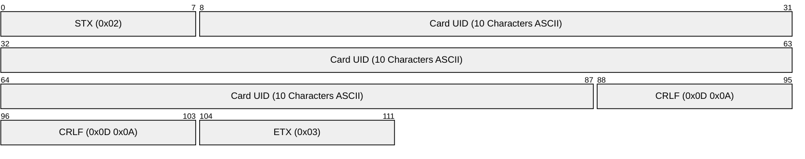

# 🔌 200. NFC 리더기 시리얼 통신 분석

이 문서는 USB 시리얼(COM 포트)로 연결된 **CR-100 NFC 카드 리더기**에서 데이터를 올바르게 수신하고 파싱하기 위한 시리얼 통신 규격 분석을 다룹니다.

---

## 🧐 통신 프로토콜 해부

NFC 리더기는 USB에 꽂았을 때 가상 COM 포트를 생성하며, 카드가 태그되면 아래와 같은 바이트(Byte) 배열 형태의 로우(Raw) 데이터를 전송합니다.

### 1. 전송 데이터 예시 (HEX & TEXT)
진단 도구를 사용해 확인한 카드 태깅 데이터는 다음과 같습니다.

```text
[바이트 수신] 13 bytes
HEX  : 02 36 38 30 30 36 39 34 38 43 35 0D 0A 03
TEXT : ·68006948C5··
```

### 2. 패킷 구조 분석 (Packet Structure)

| 바이트 번호 (Index) | HEX 값 | 역할 및 의미 | 비고 |
| :--- | :--- | :--- | :--- |
| **0** | `02` | **STX** (Start of Text) | 데이터 전송의 시작을 알리는 특수 제어 바이트 |
| **1 ~ 10** | `36 38 30 30 ...` | **카드 UID** ("68006948C5") | ASCII 텍스트로 인코딩된 10자리의 카드 고유 식별 번호 |
| **11 ~ 12** | `0D 0A` | **CRLF** (\r\n) | 줄바꿈을 의미하는 종결 문자 (Carriage Return + Line Feed) |
| **13** | `03` | **ETX** (End of Text) | 데이터 전송의 끝을 알리는 특수 제어 바이트 |



---

## 🛠️ 리더기 통신 상태 자가진단 방법

프로젝트에 동봉된 리더기 진단 도구(`tools/sniff.mjs`)를 활용하면 실시간 포트 스캔 및 수신 감지를 빠르게 수행할 수 있습니다.

### 1. 진단 스크립트 실행 명령어
터미널(PowerShell)에 아래 명령을 입력하여 리더기 통신을 확인합니다. 기본 COM 포트 속도는 `9600` baud 입니다.

```bash
# COM9 포트의 9600 속도로 데이터 감시 시작
node tools/sniff.mjs COM9
```

### 2. 통신 속도가 맞지 않아 글자가 깨질 경우 (Baud Rate 조정)
글자가 깨지거나 이상한 특수문자만 수신된다면 리더기의 보레이트(Baud Rate)가 다른 것입니다. 아래 명령어들로 알맞은 속도를 탐색해 봅니다.

```bash
# 115200 속도로 테스트
node tools/sniff.mjs COM9 115200

# 19200 속도로 테스트
node tools/sniff.mjs COM9 19200
```

> [!warning] **COM 포트 독점 주의**
> 윈도우 OS 특성상 특정 시리얼 포트(COM)는 한 번에 하나의 프로세스만 점유할 수 있습니다. 
> 진단용 `sniff.mjs`가 켜져 있는 동안에는 메인 Electron 앱에서 리더기를 열 수 없으므로, 테스트가 끝나면 반드시 `Ctrl + C`를 눌러 세션을 종료해 주어야 합니다.

---

## ⚙️ 설정 파일 (`config.json`) 반영

해당 장비 규격이 파악되면, 메인 프로그램 구동을 위해 `config.json` 파일을 적합하게 구성해 줍니다.

```jsonc
{
  "serial": {
    "port": "COM9",
    "baudRate": 9600
  },
  "parser": {
    "mode": "line",
    "trim": true,
    "delimiter": "\r\n"
  }
}
```

- `parser.mode`: `line` 형식은 시작/끝 기호를 잘라내고 순수 카드 식별자 10자리만 추출하도록 소스코드 내 `src/parser.mjs`가 제어하게 됩니다.

---

## 🔗 연결 문서
- [[000_Index|🔙 대시보드 MOC로 가기]]
- [[100_프로젝트_개요|🚀 이전 단계: 프로젝트 개요 및 철학]]
- [[300_아키텍처_및_구현|🧱 다음 단계: 앱 아키텍처 및 구현 설계]]
