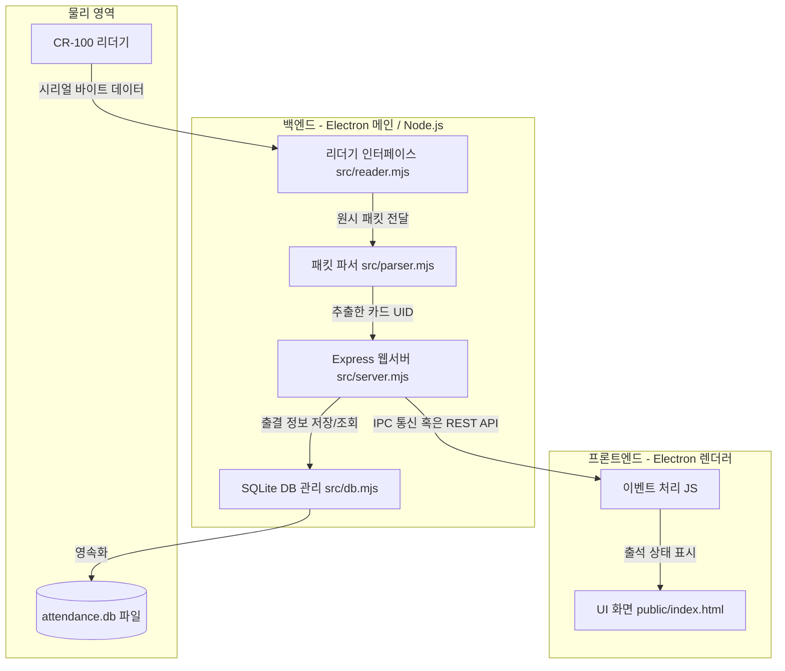

# 🧱 300. 앱 아키텍처 및 구현 설계

이 문서는 **Electron 데스크톱 엔진**과 **로컬 SQLite 데이터베이스** 기반의 서버 없는 독립 구동형 아키텍처 아웃라인과 세부 구현 특징을 설명합니다.

---

## 🏛️ 전체 시스템 아키텍처 구조

본 프로그램은 외부 인터넷 접속이 일절 불필요하며, PC 단 한 대 내에서 백엔드(서버)와 프론트엔드(화면)가 유기적으로 상호작용하도록 설계되어 있습니다.



---

## 📂 파일 구조 및 파일별 핵심 역할

프로젝트 디렉토리 내부 구조와 구성 파일별 핵심 기능은 다음과 같습니다.

- **`config.json`**
  - 프로그램 설정 파일입니다. 리더기의 COM 포트 번호, 통신 보레이트, 재태깅 방지 딜레이(Debounce) 및 서버 포트가 기술됩니다.
- **`electron-main.mjs`**
  - Electron 앱의 생명주기(Lifecycle) 및 데스크톱 창(Window)을 생성하고 관리하는 루트 진입 코드입니다.
- **`src/server.mjs`**
  - 로컬에서 구동되는 경량 웹서버입니다. 렌더러 화면과 리더기, DB 모듈 사이의 중간 다리(Controller) 역할을 담당합니다.
- **`src/reader.mjs`**
  - `serialport` 라이브러리를 이용하여 지정된 COM 포트를 감시하고, 카드가 접촉될 때 이벤트를 캐치하는 모듈입니다.
- **`src/parser.mjs`**
  - `config.json`에 정의된 구분값에 따라, 수신된 바이트 열에서 불필요한 제어 기호(STX, ETX, CRLF 등)를 정제하고 실제 카드 번호만 뽑아냅니다.
- **`src/db.mjs`**
  - SQLite 연결 인스턴스를 관리하며 학생 테이블 생성, 출석 기록 쿼리, 데이터 추출 등을 수행하는 DB 드라이버입니다.
- **`public/`**
  - Electron 창 내부 화면을 꾸미는 HTML, CSS, 프론트엔드 Javascript가 포함되어 있어, 사용자 경험(UX) 영역을 담당합니다.

---

## 💾 SQLite 데이터 영속화 & 보안 관리

프로젝트 개발 단계 및 릴리즈 실행 파일 구동 시 데이터 저장 위치와 보안 관리 형태는 아래와 같이 다르게 정의됩니다.

### 1. 데이터베이스 경로
- **개발 환경**: 프로젝트 루트 디렉토리 내의 `data/attendance.db` 파일에 기록되어 손쉬운 테이블 및 더미 데이터 검증을 지원합니다.
- **배포용 EXE 실행 시**: 사용자의 교사용 PC OS 환경의 특수 경로인 `%AppData%\nfc-attendance\attendance.db`에 저장됩니다. 이를 통해 실행 프로그램을 재설치하거나 업그레이드해도 누적 기록이 소실되지 않고 안전하게 보존됩니다.

> [!caution] **개인정보 및 보안 관리 규칙**
> - 본 프로그램은 로컬 오프라인 데이터베이스에 학생의 고유 카드 번호와 이름 등을 저장합니다.
> - 데이터베이스 파일 자체의 무단 유출을 차단하기 위해, 향후 교실 외부망으로 데이터 연동이 추가될 시에는 암호화 로직(예: SQLCipher 모듈 활용 또는 데이터 필드 대칭키 암호화)을 최우선적으로 구현하여 학생 개인정보를 강력하게 격리 보호해야 합니다.

---

## 📦 배포용 패키징 방법 (.exe 빌드)

사용자(담임 교사)에게 배포하기 위한 포터블/설치용 빌드 명령어 세트입니다.

```bash
# 1. 설치본(NSIS) 및 포터블(Portable) EXE 생성
npm run dist

# 2. 로고 아이콘 변경 시 리빌드
npm run icon
```

- **NSIS 설치본 (`dist/NFC학생출석-x.x.x-설치.exe`)**: 바탕화면 및 시작메뉴에 바로가기가 생성되는 자동 인스톨러입니다.
- **포터블 패키지 (`dist/NFC학생출석-x.x.x-portable.exe`)**: USB 등에 담아서 더블클릭만 하면 무설치로 즉시 구동할 수 있어 배포성이 극대화됩니다.

---

## 🔗 연결 문서
- [[000_Index|🔙 대시보드 MOC로 가기]]
- [[200_NFC_시리얼_통신_분석|🔌 이전 단계: NFC 리더기 시리얼 통신 분석]]
- [[400_기능_가이드|🎨 다음 단계: 학급 관리 서비스 기능 가이드]]
